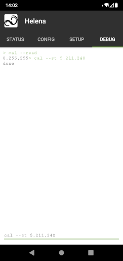

# nrf51822 equipped controller board

## Requirements
- [nRF51_SDK_v10](https://developer.nordicsemi.com/nRF5_SDK/nRF51_SDK_v10.x.x/)
- [armgcc compiler (v4.9-2015q3)](https://launchpad.net/gcc-arm-embedded/4.9/4.9-2015-q3-update)
- make
- [ARM CMSIS (v5.0.0)](https://github.com/ARM-software/CMSIS_5/tree/5.0.0)
- [nrfutil (v0.5.3)](https://github.com/NordicSemiconductor/pc-nrfutil/tree/0_5_3)
- SEGGER j-link and [nrfjprog](https://www.nordicsemi.com/Products/Development-tools/nrf-command-line-tools/download) for debuging and or programming

Open the `Makefile_sample.conf` file in the Firmware folder and adapt the paths of the tools. Then save the file as `Makefile.conf`.

To compile the bootloader just call `make`.

To compile the main firmware use
- `make helena_dbg` for helena firmware or
- `make bilina_dbg` for bilina firmware

## Programing
First program the bootloader using nrfjprog.

The main firmware should be initially programmed using the bootloader, otherwise the firmware won't start.

# Attiny45/Attiny85 equipped driver board

## Requirements
to do...

## Programing
Technically it is sufficient to program the `Helena_Base_45.hex` or the `Helena_Base_85.hex` and set the fuses to the following configurations: 
```
low  byte: 0xC2  
high byte: 0x55  
ext. byte: 0xFE  
```
Due to the fact that the reset pin is used as I/O and has to be deactivated, I recommend to program a bootloader first. This Project is using the [AVRootloader]( https://github.com/damadmai/AVRootloader) with inverted single wire configuration on PB0 and `2CHI2CSMPS` as bootsign.

## Calibration

The driver uses the internal temperature sensor of the ATTiny and the resistance of the coils to measure the LED current. Both need to be calibrated for proper operation. This can be done through the debug interface of the App with the `cal --read` and `cal --st` commands.  

With the `cal --read` command the current values can be read. The first is a temperature offset (resolution 0.25°C), the second and third are gain factors for the left (flood) and right (spot) led driver.

With the `cal --st` command new values can be stored to the driver.  

To correct the temperature just add the desired offset to the old value, e.g if the measured value is 5°C to low, add 20 to the old value.

To correct the current gain factors multiply the old value with the ratio of measured and desired value (new = old * measured / desired). Typical gain values are in the range of 220-240, the maximum value is 255.


