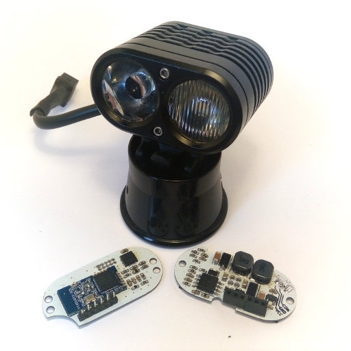

# Helena

Helena is an alternative driver for the Yinding Headlight Cycling Lamp.
## Main Features
- two independent 3A Step-Down converters to drive
  - one Cree XHP50 with a flood optic and
  - one Cree XM-L with a spot optic
- integrated motion sensor to control the LEDs in dependency of the head angle to reduce self glare when looking down and smooth transition between flood and spot LED
- bluetooth connectivity for remote control and configuration
## License
This project is licensed under the BSD-2-clause License - see the [license.txt](license.txt) file for details
