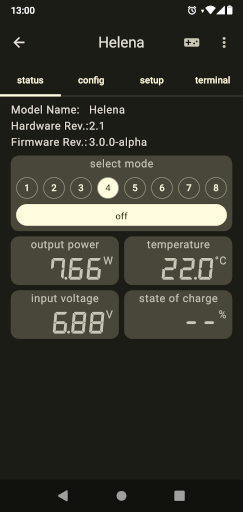

# Helena

 

Helena is an alternative driver for the Yinding or KD2 Headlight Cycling Lamp.

## Main Features

- Two independant 3A Step-Down current converters.
- Bluetooth connectivity for remote control, configuration and lamp-to-lamp connection.
- Linear power reduction at low battery and high temperature.
- Standby current less than 150µA.
- Supports 1 (one LED), 2 (one or two LEDs) or 3 (up to three LEDs in series) cell Li-Ion battery.
- An integrated motion sensor to control the output current to reduce glare when looking down.
- A multi-functional com pin, can be used for wired communication or an external button.

## License

This project is licensed under the BSD-2-clause License - see the [license.txt](license.txt) file for details
